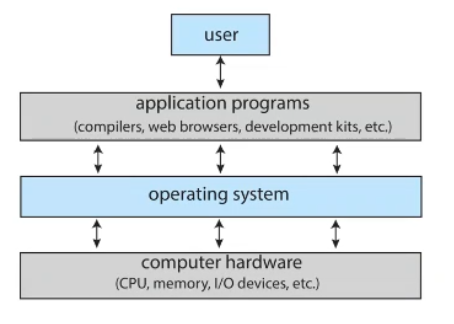

# 1.Hardware

# 2.Application programs

# 3.Operating system(OS)

## operating system views 
1.resource allocator
2.control program

## operating system = Kernel + System programs 
### Kernel is the one program running at all times
### System programs are associated with the operating system
### Application programs are not associated with the operating system

