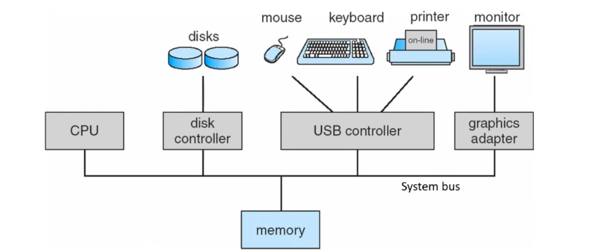
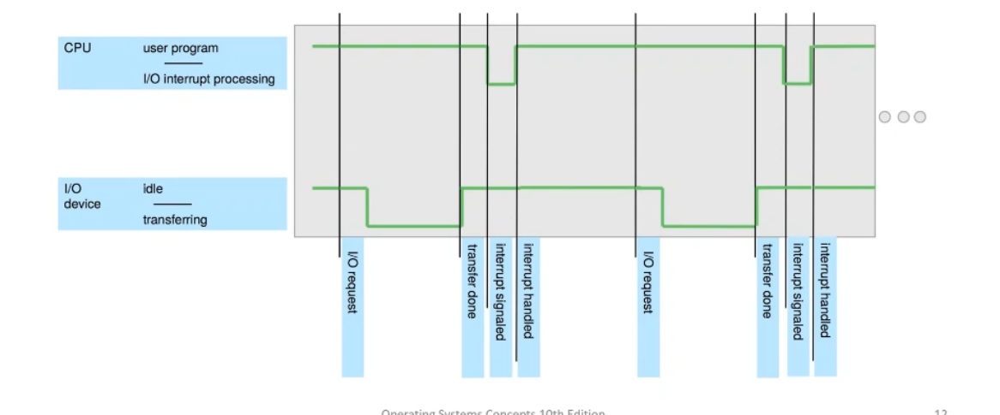
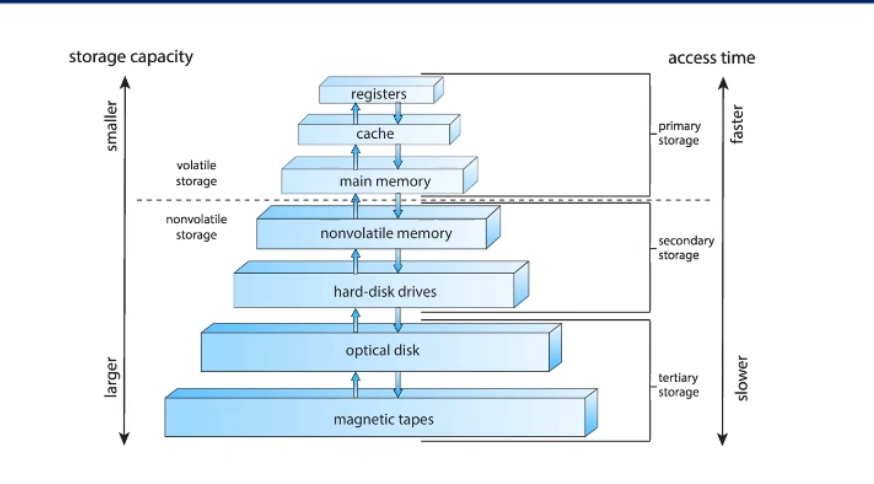
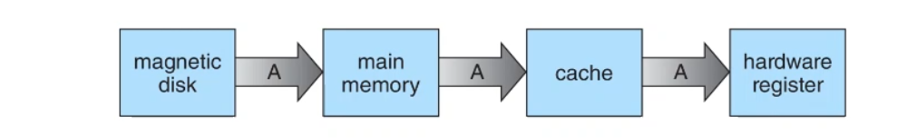
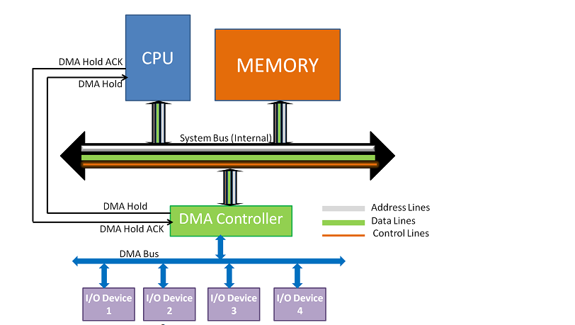
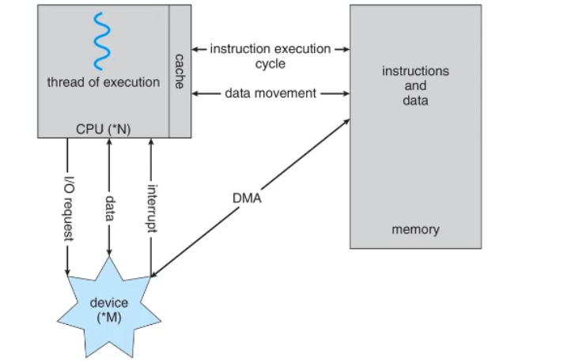

### CPU

### Disk controller
  Disk controllers are hardware components responsible for managing the flow of   data between the computer's central processing unit (CPU) and storage devices such as hard disk drives (HDDs), solid-state drives (SSDs), or optical drives.

### USB controller 
  manages the communication between a computer and USB (Universal Serial Bus) devices. It's responsible for controlling USB ports and facilitating data transfer between the computer and connected USB devices.
### Graphic adapter 
  A graphics adapter, also known as a graphics card, video card, or GPU (Graphics Processing Unit), is a hardware component responsible for generating and rendering images, videos, and graphical user interface elements on a computer's display.
### memory
  Shared between these controllers and CPU 
### BUS 
   Used to transfer data between memory , CPU and controllers

	### Bootstrap program
### a simple program stored in ***ROM or EEPROM*** 
### it is also know as ***Firmware***
### it run after power up or rebooting the device to 
1. it is known as the BIOS 
2. initializ some of  hardware  and make sure that some devices are connected like (RAM , Screen ,.............)
3. load the main boot-loader (like ***GRUB*)
4. BIOS may be updated , so in most device it exist in ***EEPROM*** but it has a limit number of erasing and writing 
## 1.interrupt
is a signal which generated according to some events 
it may be a **Hardware** or **Software** 
a Hardware generated interrupt occur by sending signal to CPU 
a Software generated interrupt occur by executing a system call
each interrupt has an interrupt service routine (handler)
the interrupt vector is stored in low memory and hold the addresses of ISR
each archietectur has  different number of interrupts and events 

## 2. storage structure

### instruction life cycle 
a.fetch --> fetch the instruction from the instruction memory
b.decode --> understanding the instruction type and it's operands to perform the ALU
c.execute --> executing the instruction 
d.store --> store the result in register or memory 

##  caching
**caches** can be installed to improve access time or transfer rate 
**caching** refers to use a high speed memory to hold a copy of recently accessed 
**cache coherency** if we have multi cores , every core has it's own cache L1 so may be one core cache variable and updating it's value and the other core use the same variable 
**cache coherency** must occur  if one core update variable used by the other cache it will inform it .

when the cache full , the processor search for unused variables then update them values in the main memory and finally replace them with the new one 

in this picture the main memory cache from the magnetic disk , the caches cache from the main memory and finally the registers cache from  caches .

## 3.I/O structure 
• A general-purpose computer system consists of CPUs and multiple device controllers connected through a common bus. 
• Each device controller controls a specific type of device (e.g. USB). 
• A device controller has a local buffer storage and a set of registers. 
• The device controller is responsible for moving the data between the peripheral devices that it controls and its local buffer storage. 
• The operating system provides a device driver that understands the device controller and provides a uniform interface to the device.
### Direct memory access (DMA)
if we transfer large block of data we can't interrupt the CPU every bytes !!!!
first the the CPU access the DMA to transfer the data and determine the source and the destination of this data .
the DMA start transferring .
every period of time the DMA should tell the processor the status of this operation .

