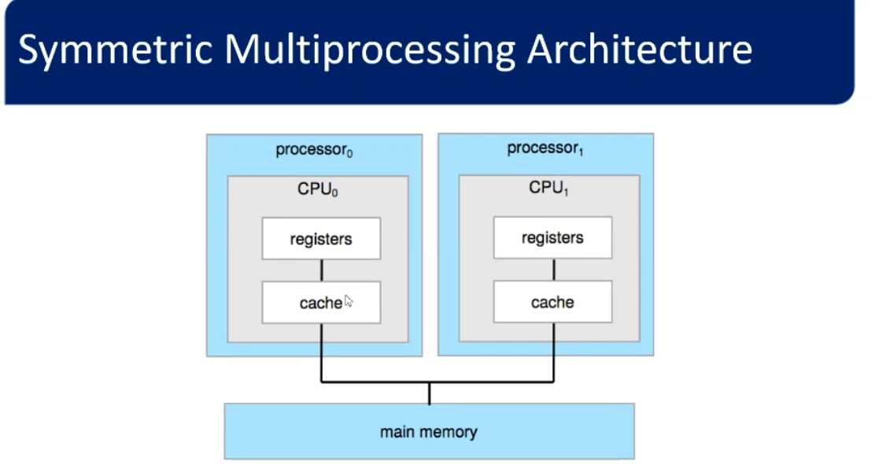
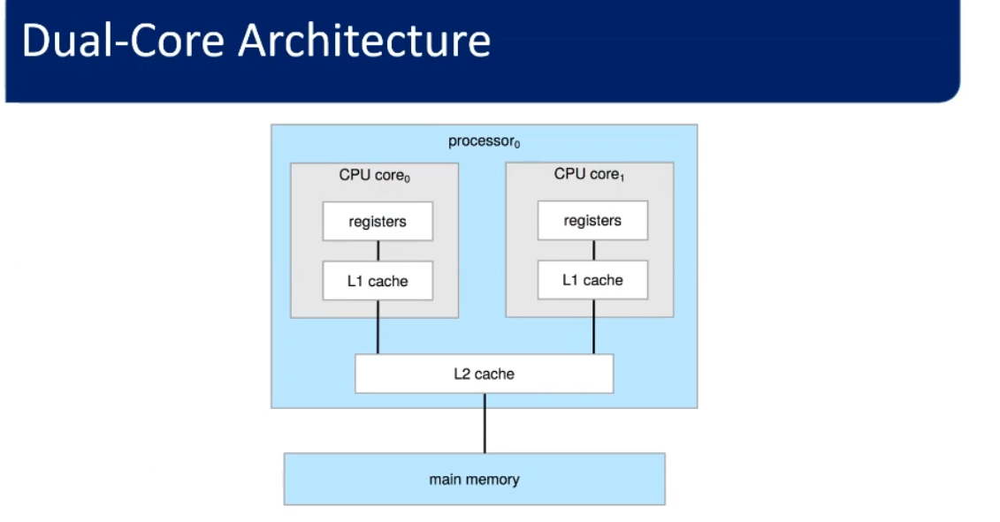
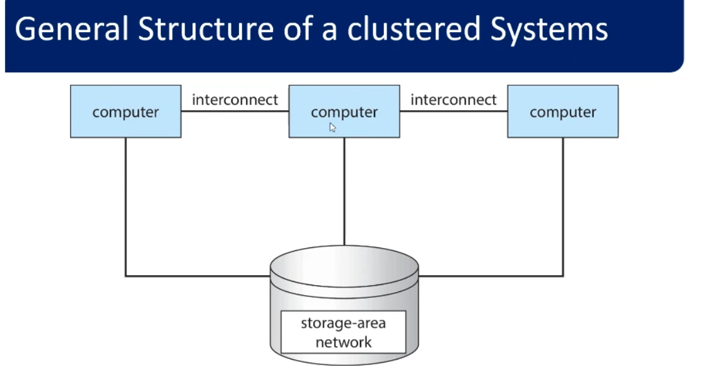

## 1.single processor  systems

has only one general purpose processor 

## 2. multiple-processor systems

it known as **parallel** system or **tightly-coupled** system
two or more general processor .

### types of multiple-processor systems
**1.Asymmetric multiprocessing**
• This scheme defines a boss-worker relationship. 
• The boss processor schedules and allocates work to the worker processors. 
• Worker processors look to the boss for instruction or have predefined tasks. 

**2. Symmetric multiprocessing (SMP)** 
• Used by most systems.
• No boss-worker relationship. 
• All processors are peers, where each processor can perform any task.

### multi-core systems 
Multi-core systems are multiple processor and not vice versa 
may multiple processor (each processor is only one core )

## 3. clustered system 

• Also known as loosely-coupled systems. 
• Composed of two or more individual systems (or nodes). 
• Each node may be a single processor system or a multicore system. 
• Clustered computers share storage and are closely linked via a LAN.

***Types of Clustering***
1.Asymmetric clustering
• One node is in hot-standby mode monitoring the active server. 
• If the active server fails, the hot-standby node becomes the active server. 
• Supports high-availability service, where a node failure does not stop service.
 
  
  
2.Symmetric clustering
• Two or more nodes are running applications and are monitoring each other. 
• Supports high performance computing better than multiprocessor systems. 
• An application can run concurrently on all cluster nodes using parallelization. 
• Parallelization divides a program into separate components to run in parallel.
