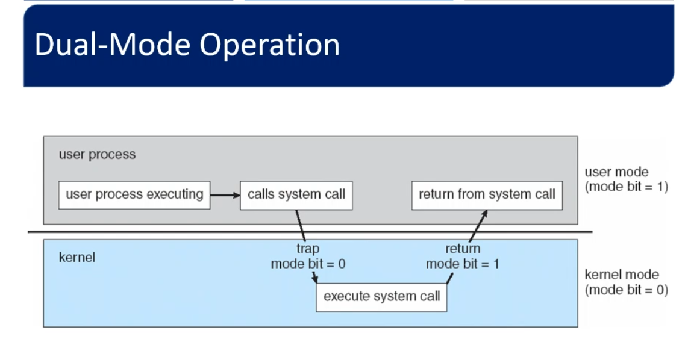

## Dual mode operating operation

two mode of operation (user , kernel)
a mode bit indicate the current mode  0 for kernel and 1 for user 
to change mode bit must be privileged mode (kernel mode )
all the instructions that may cause harm are deigned as a privileged 
privileged  instructions can executed only in the kernel mode (like instruction to change the bit mode , timer interrupt [OS ticker])

## Multi mode operation 
CPU that support virtualization can have third mode ***VMM mode*** 
VMM has provide more privileged than user mode and less privileged than kernel mode 
it make sense if we run another OS on virtual machine , the application of this OS must run in the user mode and if we make the OS of virtual machine run in kernel mode , it may be affect on the real OS , so we run this in VMM mode 

## Timers
the operating system determine a period for every task to run 
after this period the timer will generate an interrupt , so the mode will switched to kernel 
the kernel decide to give it another time or run another task instad it.
so the timer function is an OS ticker to generate an interrupt every specific period seted by the kernel .
the instruction to modify the timer content must be privileged .

