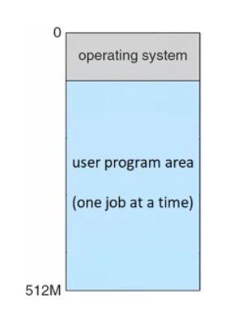
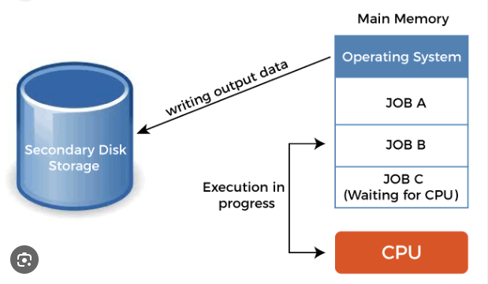
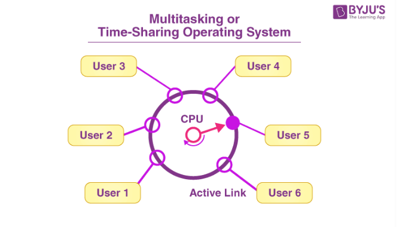
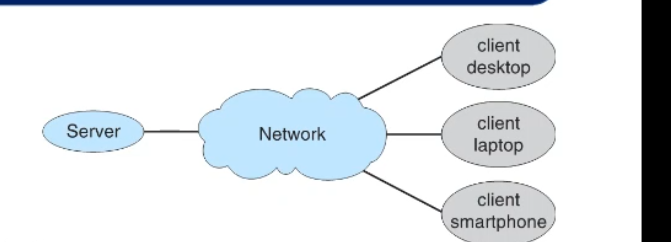
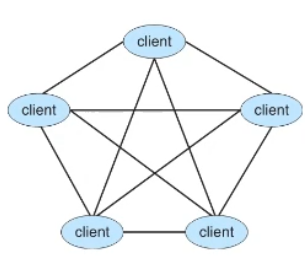
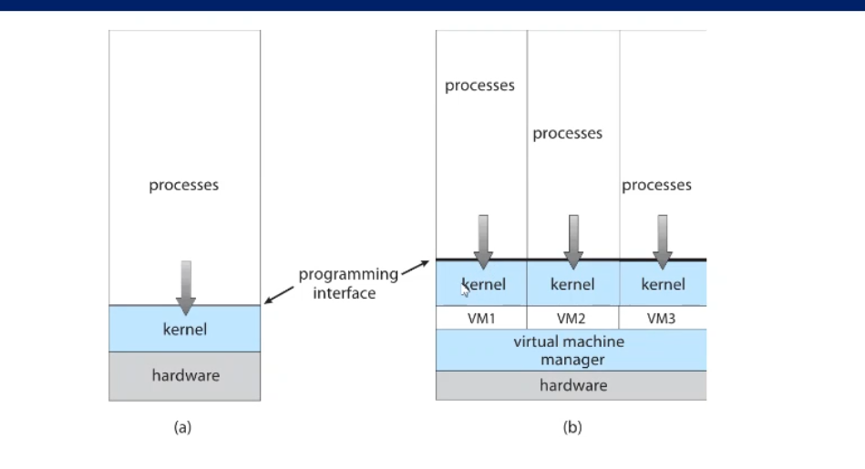
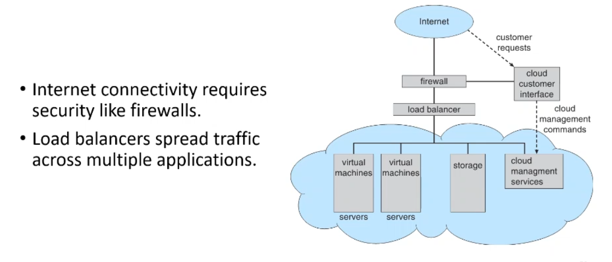

## 1. Traditional computing 
- Computer systems started as  mainframe computers 
- mainframe used batch systems to multi-programming systems and then time sharing systems
### batch systems 
- one job after another .
- only the OS and the current job in the main memory , the other jobs are waiting in the disk 
- if the job need I/O devices the CPU remains idle waiting for this job
 
## Multi programming systems 
- several jobs are kept in main memory 
- the CPU always execute jobs (no idle time)
- if the job need I/O operation the CPU will execute/continue  another job 
- if the job doesn't need any I/O operation the CPU will finish this job first 
- the main disadvantage for this system , that if any job need high time to execute , the CPU will first finish this job 
- the only way to make job wait , when it need I/O operation
- the OS must provide several features :
  1. I/O routines --> only the OS can perform I/O operation 
  2. CPU scheduling --> to select job for execution 
  3. memory management --> allocate memory for several jobs 
  4. Resource allocation --> no job can use resources that used by other jobs 

## Time sharing systems 
- an interactive computer systems 
- Time sharing or (multi-tasking)

***note that*** :
1. multi programming --> the CPU will execute the job until it finish or need I/O operation .
2. multi tasking --> the CPU will schedule between jobs and set time for each job 

## 2. Desktop Computing
## 3. Mobile Computing
## 4. Distributed computing 
- there is a distance between nodes 
- PAN - LAN - MAN - WAN 
- may take the form of client-server computing or peer to peer computing 
- client server --> like facebook , social media applications 
- there is a server store database and response to your request 
- if the server dropped , there is no services .
- 
- peer to peer --> like  bittorrent the files are shared between users 
- the file which you want will be in many client like you , and you will download it from them 
- every user can be a server or client .
- if the server is dropped , the service is still continue .
- 
## 5.Virtualization 
- Allows for creating a virtual machine that acts like a real computer.
- A single computer (host) may run several virtual machines (guests).
- The host and the guests share the hardware, but each has its own OS.
- The virtual machine manager runs the guest machines, manages their resource use, and protects each guest from the others.
- 

## 6. Cloud computing 
- Delivers computing as a service and users pay based on usage. 
- Uses virtualization to run millions of VMS on thousands of servers.
-  A cloud service can be categorized as public, private, or hybrid cloud. 
	-  A public cloud is available to anyone via the Internet. 
	- A private cloud is used only by the company owning it. 
	- A hybrid cloud includes both public and private cloud components. 
- It may provide infrastructure, platform, or application as a service.
	 - Software as a service (SaaS) provides applications (e.g. Google Docs). 
	 - Platform as a service (PaaS) provides a software stack (e.g. Google Firebase).
	 - Infrastructure as a service (IaaS) provides servers or storage over the internet

## 7. Real time embedded systems 
