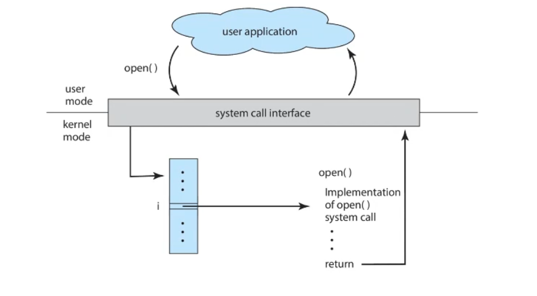
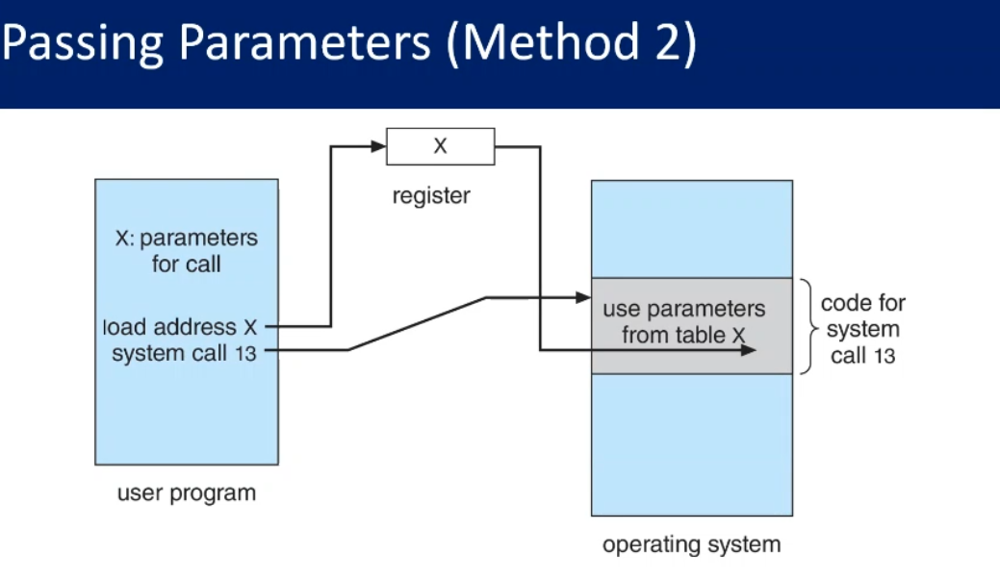

### the interface between user space and operating system.

### passing parameters to system calls: 
1. Pass the parameters in the CPU registers 
2. store the parameter in memory , and pass the address of this memory to the CPU
3. push the parameters onto the stack  

