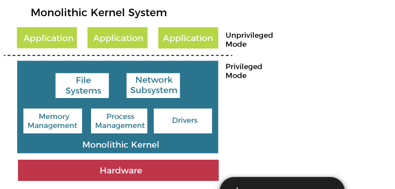
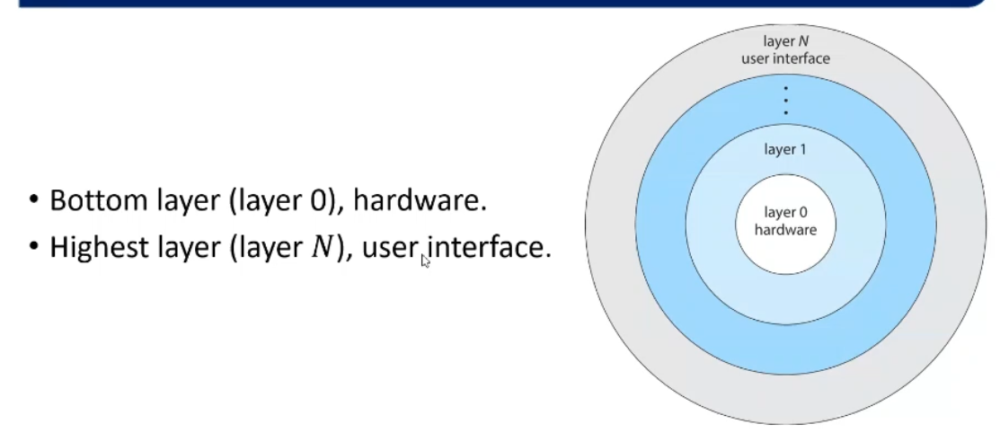
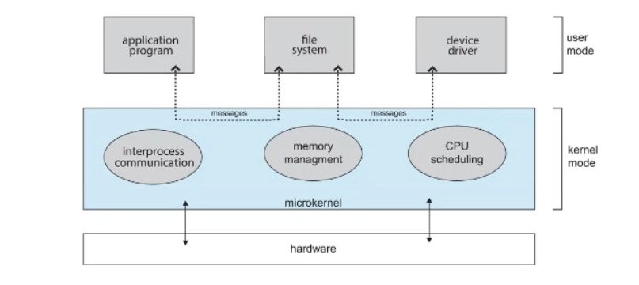
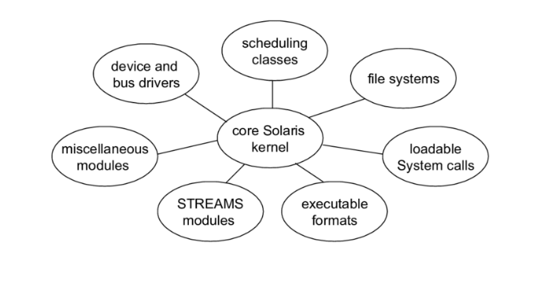

## 1.Monolithic Approach 
no structure at all.
difficult to implement and extend .
fast 
very overhead 
tightly coupled --> change in one part can affect on other parts 

## 2.Layered Approach 
Divides OS to several layers 
easy to implement and extend 
loosely coupled  --> change in one layers doesn't affect other layers
every layer has API to interface 

## 3.Micro-kernel Approach
Remove all the nonessential component from the kernel and implement them as a system program in the user space 
easy to extend OS easy to modify the kernel 
easy to port OS from one hardware to another 
more security and reliability 

## 4.Modules Approach
The kernel has a set of core components and can link in additional services via loadable kernel modules (LKMs)

## 5.Hybrid Approach
the combination of different structures 
for example --> Linux use Monolithic and Modules Approach
