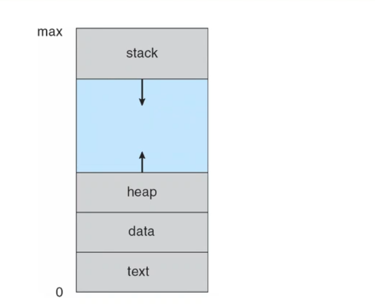
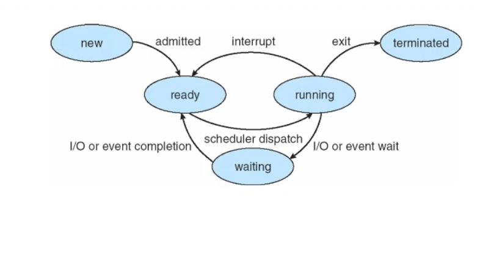
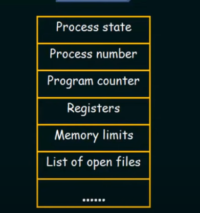
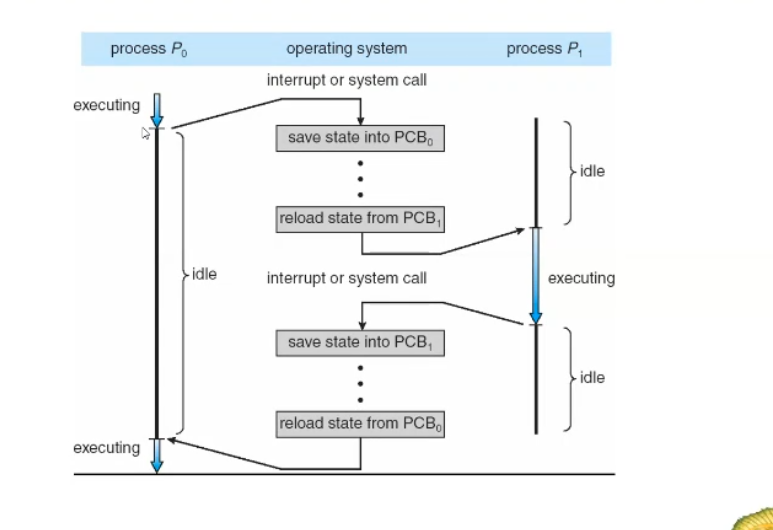

## introduction
Process is a running program 
in batch system --> job
in sharing time system --> user program , task
every process has a part of memory divided into sections 
text , data , heap stack sections 

## process state 
the states are different from OS to another 
#new state --> when the process is being created  
#ready state --> the process is launched but the CPU execute another process 
#running state --> OS determine to run this process 
#waiting state --> the process will wait for event of I/O operation 
#terminated state --> the process is exit 

## Process control block 
it contain information about process (state , PC , register values , ...........)

## CPU switch from process to another process

