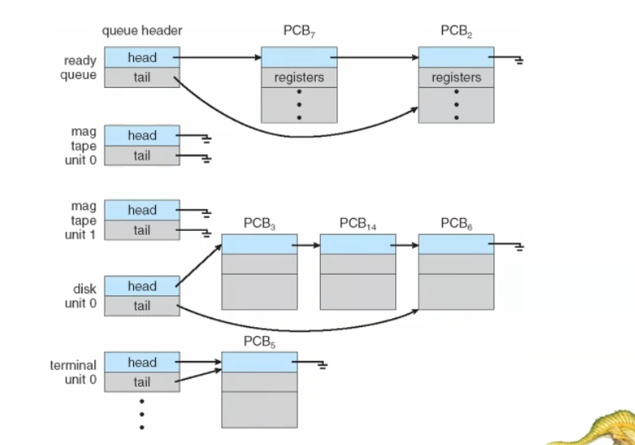

the CPU schedule between process 
there are scheduling queues of processes
### 1. job queue
set all the processes in the system 
### 2.Ready queue
set the ready processes(waiting the OS to select it to execute)
### 3.Device queues
every I/O device has queue to store the processes waiting  for it 

