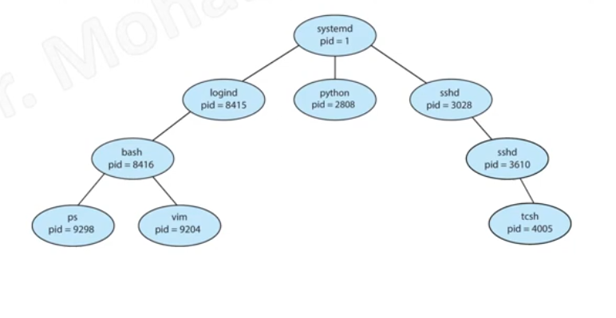

## 1.Process creation 
process may create several processes .
the creating process is the ***parent*** and the created one is the ***child*** 

## 2. Process termination 
the process terminated when it finished execution 
there is a system call ***exit***  to terminate processes
in some systems , if the parent process terminated , it first kill all the child process first  [cascading termination]

