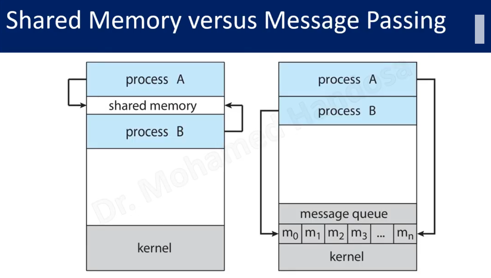

the independent process doesn't share data with other processes
the cooperating process need to share it's data with other processes
why we need to support the cooperating processes ? 
1. information sharing 
2. computation speedup (divide the large task into sub-tasks run in parallel )
3. Modularity Divide the function of a system into separate processes (not for the speedup but , for the development the process in this case easy  to develop , fix bugs and updating  ).
cooperating processes need IPC (inter process communication )mechanism to share data 
we have two mechanism (shared memory , message passing )

