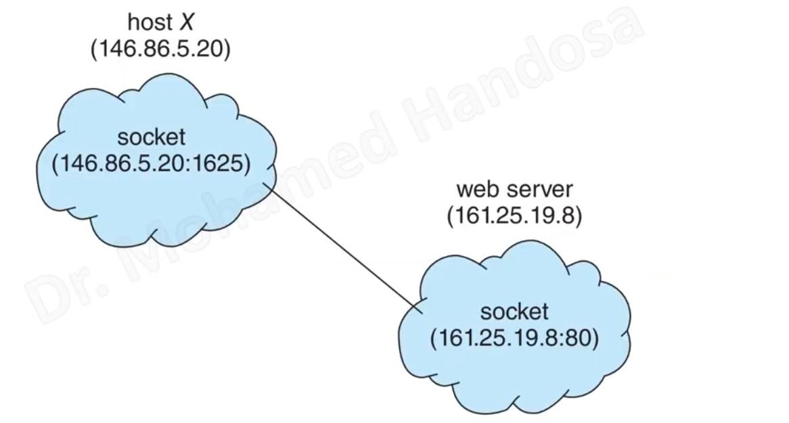
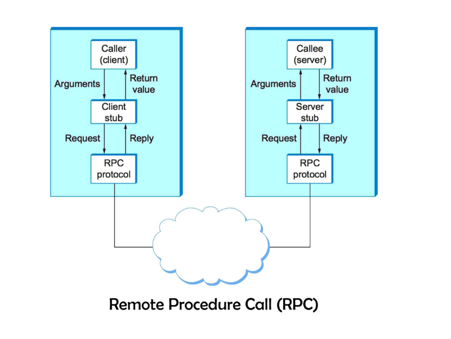

## 1.Socket 

Identified by IP address connected with Port (IP + Port number)

## 2.Remote Procedure Calls(RPC)

client can invoke procedure remotely.
if we have multi method shared between tasks do the same function we can collect them in server and the all process can invoke them 

