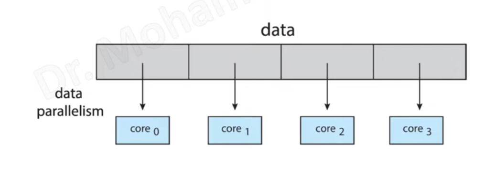
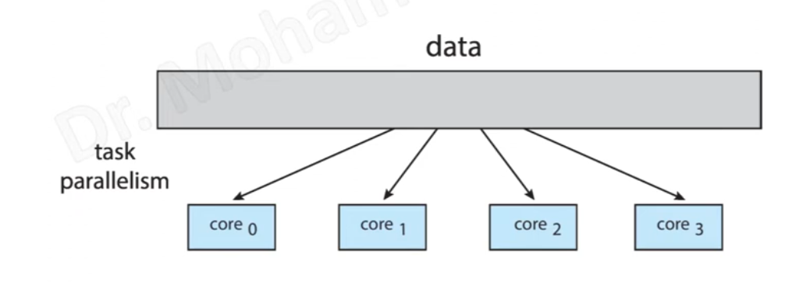

## 1.Data parallelism

Data Parallelism means concurrent execution of the same task on each multiple computing core.

Let’s take an example, summing the contents of an array of size N. For a single-core system, one thread would simply sum the elements [0] . . . [N − 1]. For a dual-core system, however, thread A, running on core 0, could sum the elements [0] . . . [N/2 − 1] and while thread B, running on core 1, could sum the elements [N/2] . . . [N − 1]. So the Two threads would be running in parallel on separate computing cores.

## 2.Task parallelism
Task Parallelism means concurrent execution of the different task on multiple computing cores.

Consider again our example above, an example of task parallelism might involve two threads, each performing a unique statistical operation on the array of elements. Again The threads are operating in parallel on separate computing cores, but each is performing a unique operation.

