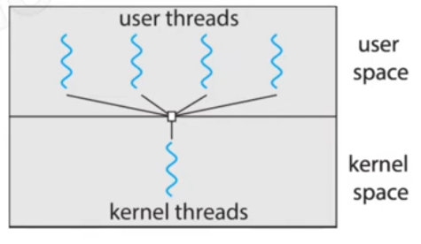
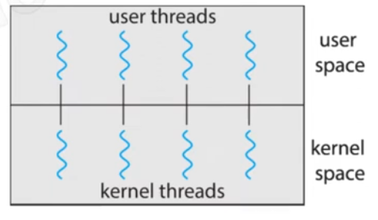
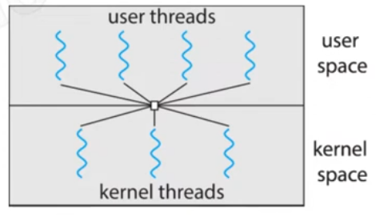
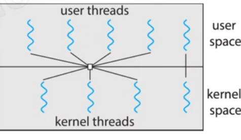

## user threads vs kernel threads 

User threads are managed without OS (library in the user space)

Kernel threads are managed by the OS 

## 1.many to one model 
the kernel doesn't support threads so we use library in the user space to generate threads 
all the user threads are managed by one kernel threads

## 2.one to one model
every user thread has kernel thread 

## 3.many to many model
there is a limit in the number of kernel threads 

## two level model
we use many to many model but the important user threads have kernel threads 
