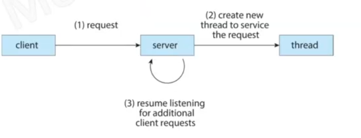
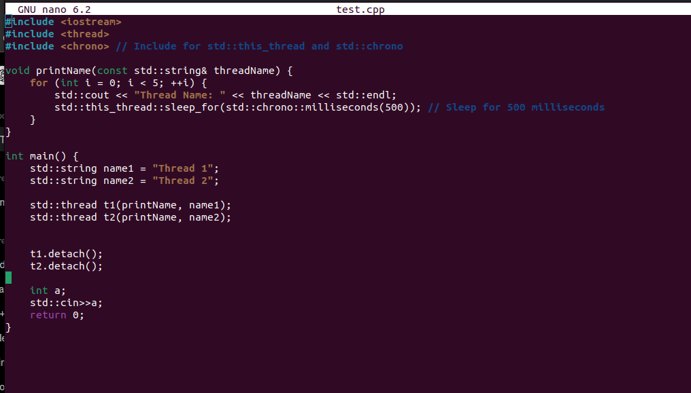
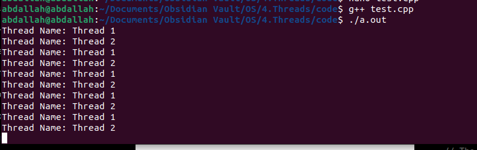
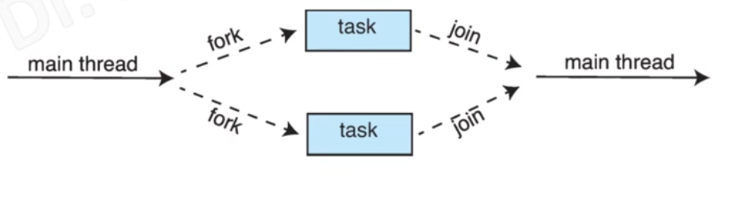
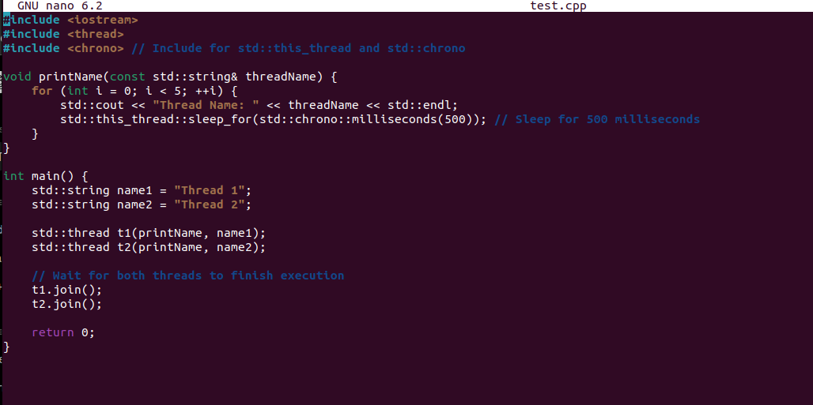

## Explicit threading 
the server create thread for each request
one to one model (each user thread create kernel thread)

## implicit threading
programmers create tasks no thread then by using library to assign this task to thread
there are two types (thread pool , fork-join )
thread pool --> for a synchronous (independent) threads 
fork-join --> for synchronous (dependent ) threads 

## thread pool 
at startup the server create a set of threads in a pool 
when the server receive request , it submit it to the pool 
	if the pool has thread the request served immediately 
	if the pool is empty the task is queued until one thread become free 
once a thread complete serving , it return to the pool 
there are limiting number of creating threads (many to many model)
a ***dynamic thread pool*** can change the number of threads according to the overhead of the processor (may increase or decrease) .

## fork join

• In traditional fork-join, the main parent thread does the following: 
1. Create (i.e., forks) one or more child threads. 
2. Wait for the created threads (children) to terminate. 
3. Join the threads, at which point it can retrieve and combine their results. 
• Implicit fork-join is a synchronous version of the thread pool. 
	• Threads are not constructed but parallel tasks are designated. 
	• A library manages the creation of threads and assigns tasks to those threads.

