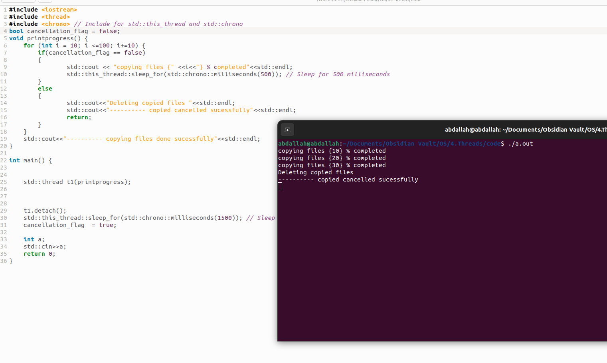

terminate the thread before it has completed 
cancellation can be asynchronous or deferred

## asynchronous Cancellation
one thread immediately terminate the target thread
## deferred Cancellation
the target thread periodically checks if the thread should terminate or not 

