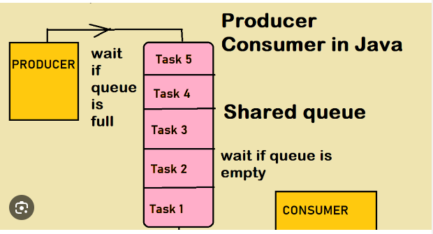
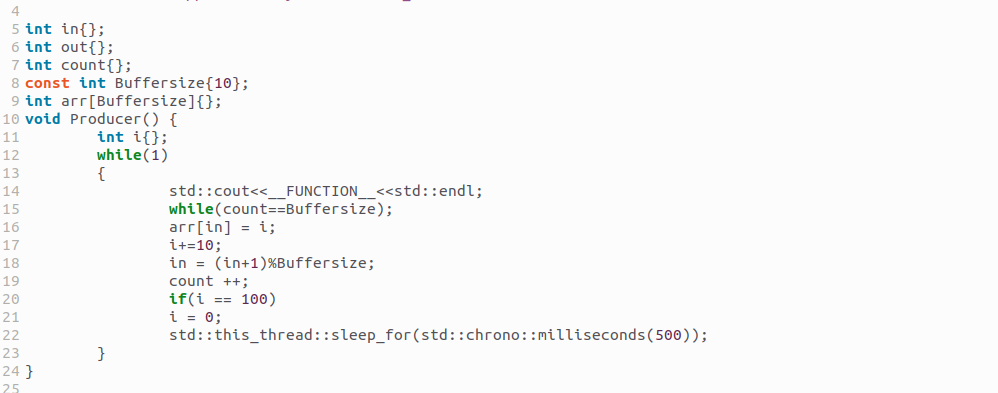
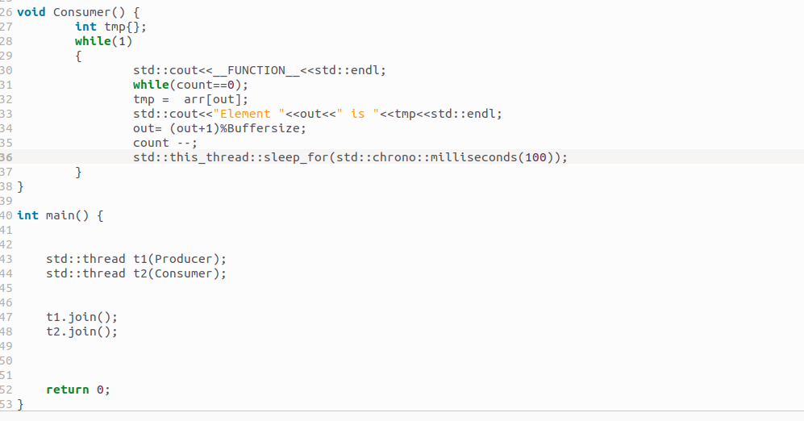
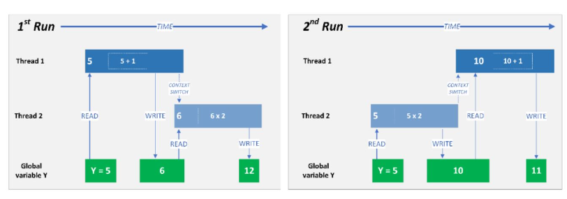
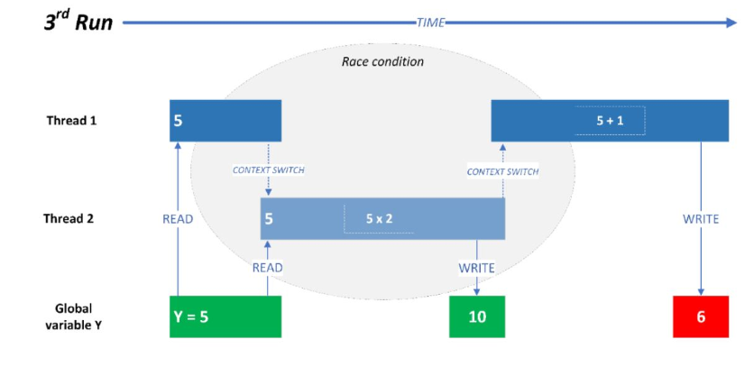
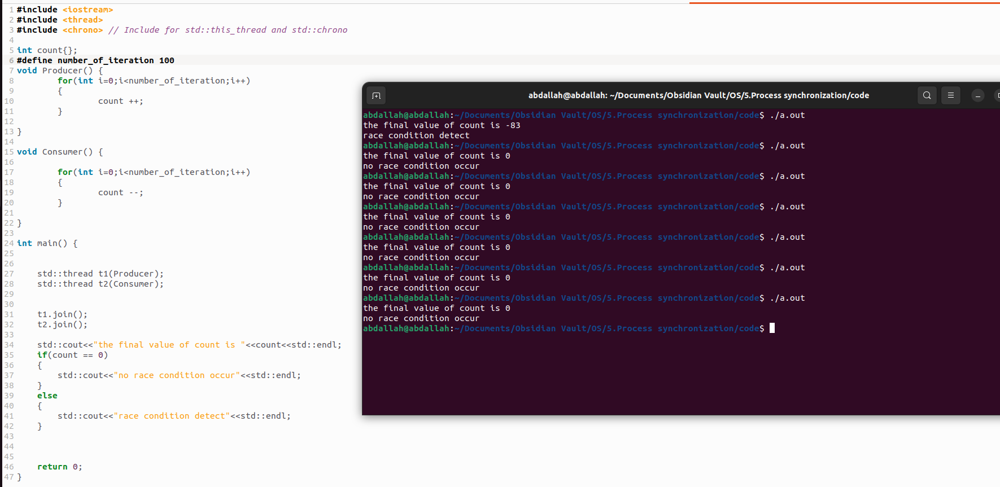
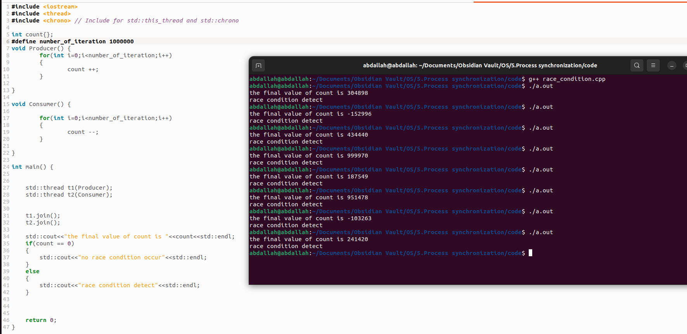

## solution is 

Producer will wait if there is no enough space 

the consumer will wait if there is no element in the buffer  

the sleep time here is not equal in both threads and there is no data inconsistency

## Race condition 
**Race conditions occur in multi threaded software when multiple threads attempt to modify a piece of shared data at the same time. This can become a potentially serious problem if the output of one thread’s execution affects another thread’s execution, in a way that causes unexpected or incorrect results.**

## The problem with race conditions

Whether or not a race condition occurs – and whether or not it results in errors – depends on the relative timing behaviours of the competing threads. In a non-deterministic system, these behaviours can be different for each run of the software.

In the example below, Threads 1 and 2 are accessing and modifying a global variable, ‘Y’. The behaviour of the threads changes from one run to the next, but because each thread is able to complete without interruption, a correct (if different) value results each time.

During the third run, however, the behaviour changes again. Here, Thread 1 is interrupted before it completes, and Thread 2 modifies the global variable that Thread 1 used as its input. Now, when Thread 1 completes, it writes a value that is unexpected.

## in the producer and consumer example:
• TO: producer       register1  = count                  (register1 = 5) 
• T1: producer        register1  = register1 + 1       (register1 = 6) 
• T2: consumer      register2  = count                  (register2 = 5) 
• T3: consumer      register2  = register2 - 1       (register2 = 4) 
• T4: producer        count       = register1             (count = 6) 
• T5: consumer       count      =  register2            (count = 4)

