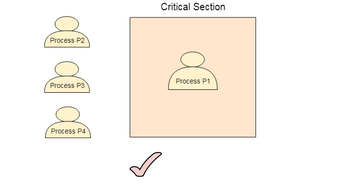

 Critical Section is the part of a program which tries to access shared resources. That resource may be any resource in a computer like a memory location, Data structure, CPU or any IO device.

The critical section cannot be executed by more than one process at the same time; operating system faces the difficulties in allowing and disallowing the processes from entering the critical section.

The critical section problem is used to design a set of protocols which can ensure that the Race condition among the processes will never arise.

In order to synchronize the cooperative processes, our main task is to solve the critical section problem. We need to provide a solution in such a way that the following conditions can be satisfied.

## Requirements of Synchronization mechanisms
1. **Mutual Exclusion**
2. **Progress**
3.  **Bounded Waiting**
4. **Architectural Neutrality**

**Mutual Exclusion**
Our solution must provide mutual exclusion. By Mutual Exclusion, we mean that if one process is executing inside critical section then the other process must not enter in the critical section.

**Progress**
Progress means that if one process doesn't need to execute into critical section then it should not stop other processes to get into the critical section.

**Bounded Waiting**
We should be able to predict the waiting time for every process to get into the critical section. The process must not be endlessly waiting for getting into the critical section.

**Architectural Neutrality**
Our mechanism must be architectural natural. It means that if our solution is working fine on one architecture then it should also run on the other ones as well.

