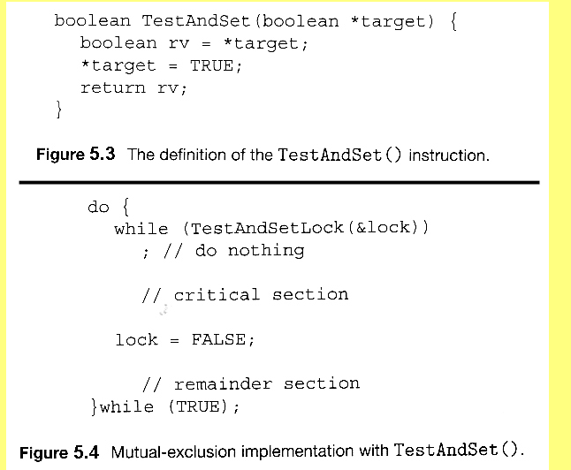
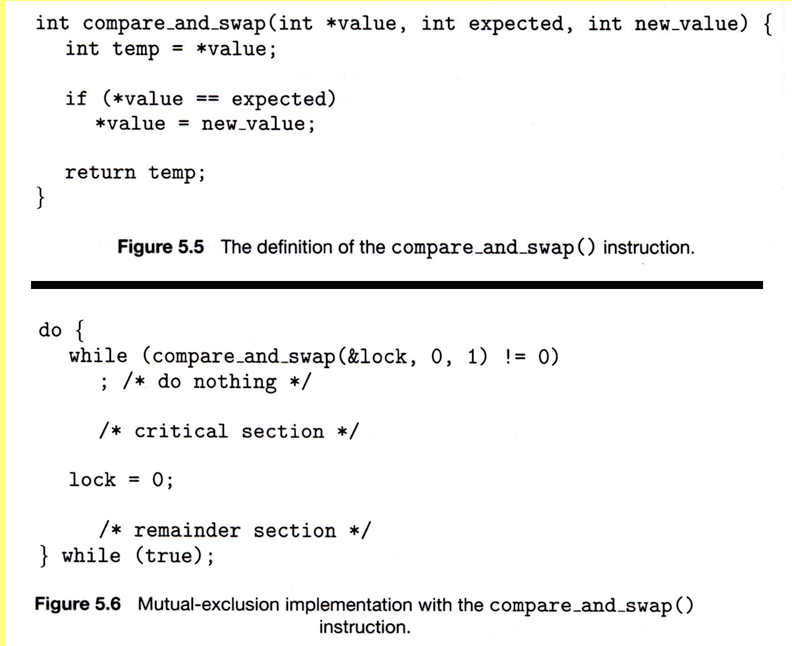

• Many modern computer systems provide hardware instructions to: 
	• Test and modify the content of a word 
	• Swap the contents of two different words
• These instructions are atomic (execute as one uninterruptible unit).
• These instructions can be used to solve the critical-section problem.

