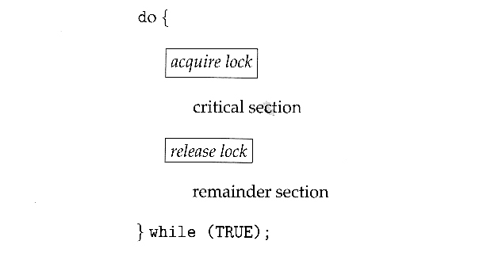
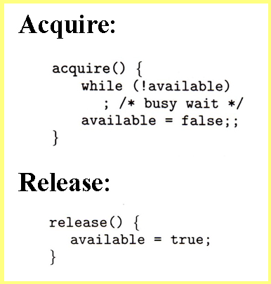
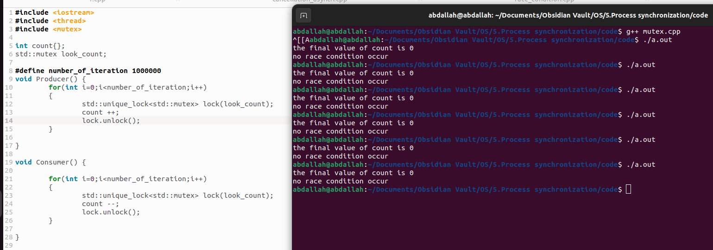

- The hardware solutions presented above are often difficult for ordinary programmers to access, particularly on multi-processor machines, and particularly because they are often platform-dependent.
- Therefore most systems offer a software API equivalent called _**mutex locks**_ or simply _**mutexes.**_ ( For mutual exclusion )
- The terminology when using mutexes is to _**acquire**_ a lock prior to entering a critical section, and to _**release**_ **it when exiting**

- Just as with hardware locks, the acquire step will block the process if the lock is in use by another process, and both the acquire and release operations are atomic.
- Acquire and release can be implemented as shown here, based on a boolean variable "available":

