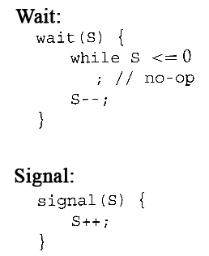
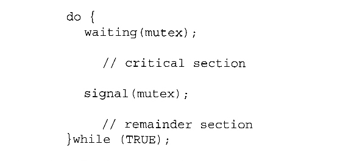
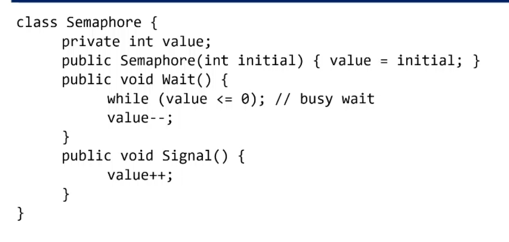
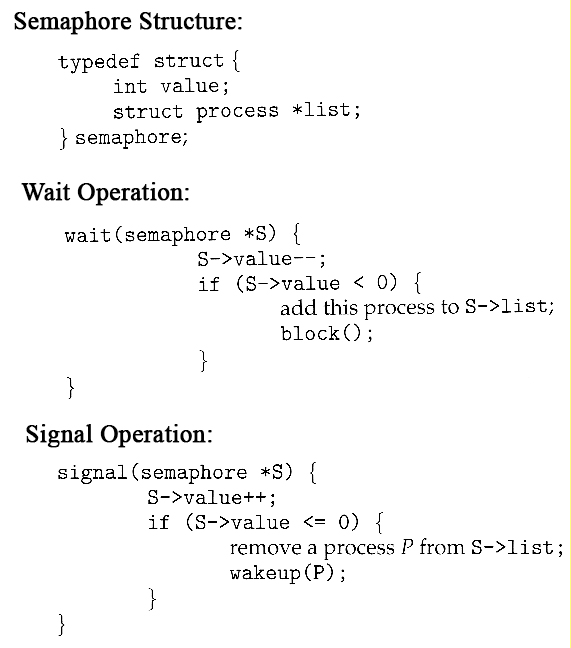

A more robust alternative to simple mutexes is to use _**semaphores**_, which are integer variables for which only two ( atomic ) operations are defined, the wait and signal operations



## binary Semaphore and counting semaphore

**binary :-**
behave like mutex .
value is range only between 1 and 0 .



**counting :-**
can take on any integer value.
usually used to count the number remaining of some limited resource.
The counter is initialized to the number of such resources available in the system.

- First we create a semaphore named synch that is shared by the two processes, and initialize it to zero.
- Then in process P1 we insert the code:
```c++
void p1()
{
	S1;  
    signal( synch );
} 
```

- and in process P2 we insert the code:
```c++
void p2()
{
	wait( synch );  
    S2;
} 
```

- Because synch was initialized to 0, process P2 will block on the wait until after P1 executes the call to signal.

####  Semaphore Implementation


#### the busy wait problem
• When a process executes Wait() it enters a busy wait loop. 
• Instead of keeping the CPU busy, a process can suspend itself. 
• The suspend operation places a process into a waiting queue. 
• The CPU scheduler, then can select another process to execute. 
• A suspended process should be restarted when Signal() is called
