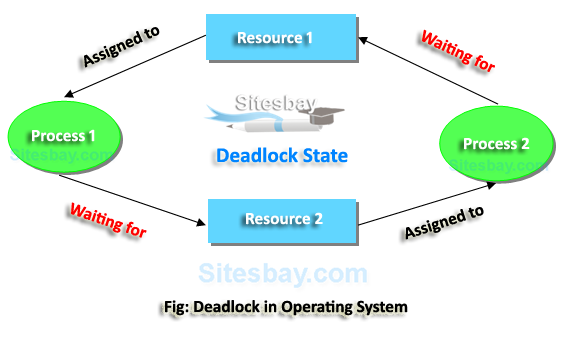
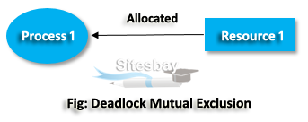
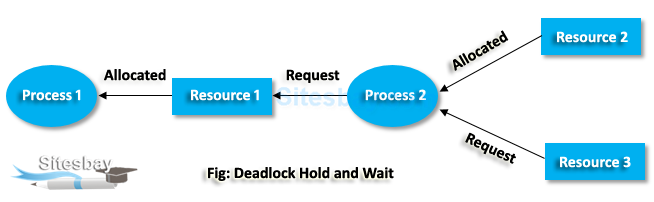
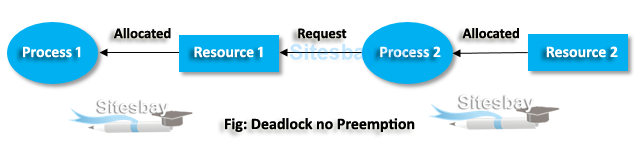
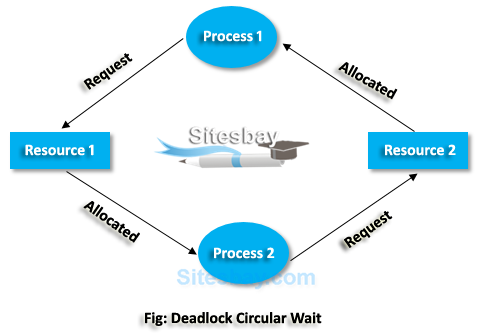
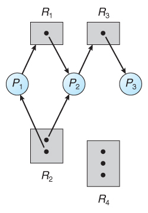
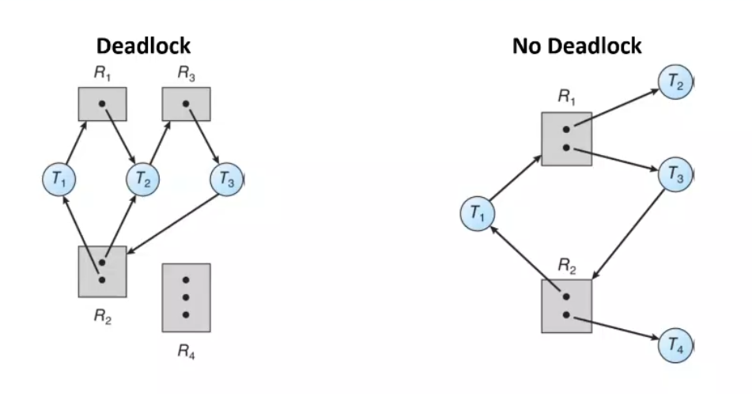

Deadlock is a situation where a set of processes are blocked because each process is holding a resource and waiting for another resource acquired by some other process.

It is a situation that occurs in OS when any process enters a waiting state because another waiting process is holding the demanded resource.

### When Deadlock Arise
**Mutual Exclusion:** One or more than one resource are non-shareable (Only one process can use at a time).

There should be a resource that can only be held by one process at a time. In the diagram below, there is a single instance of Resource 1 and it is held by Process 1 only.

**Hold and Wait:** A process is holding at least one resource and waiting for resources. In this condition, processes must be stopped from holding single or multiple resources while simultaneously waiting for one or more others.

A process can hold multiple resources and still request more resources from other processes which are holding them. In the diagram given below, Process 2 holds Resource 2 and Resource 3 and is requesting the Resource 1 which is held by Process 1.

**No Preemption:** A resource cannot be taken from a process unless the process releases the resource. A resource cannot be preempted from a process by force. A process can only release a resource voluntarily. In the diagram below, Process 2 cannot preempt Resource 1 from Process 1. It will only be released when Process 1 relinquishes it voluntarily after its execution is complete.

**Circular Wait:** A set of processes are waiting for each other in circular form. It imposes a total ordering of all resource types. Circular wait also requires that every process request resources in increasing order of enumeration.

A process is waiting for the resource held by the second process, which is waiting for the resource held by the third process and so on, till the last process is waiting for a resource held by the first process. This forms a circular chain. For example: Process 1 is allocated Resource2 and it is requesting Resource 1. Similarly, Process 2 is allocated Resource 1 and it is requesting Resource 2. This forms a circular wait loop.

### Resource Allocation Graph (RAG) in Operating System

A resource allocation graphs shows which resource is held by which process and which process is waiting for a resource of a specific kind.

Deadlock Conditions in RAG
• If the graph contains no cycles, then no deadlock. 
• If the graph does contain a cycle, then a deadlock may exist. 
• A deadlock exists in the following cases: 
	• If each resource type has exactly **one instance**, then a cycle implies that a deadlock has occurred. 
	• If the cycle involves only a set of resource types, each of which has only a single instance, then a deadlock has occurred. 
• If each resource type has several instances, then a cycle does not necessarily imply that a deadlock has occurred. 
• A cycle in the graph is a necessary but not a sufficient condition for the existence of deadlock.

### Methods for Handling Deadlocks

- Generally speaking there are three ways of handling deadlocks:
    1. Deadlock prevention or avoidance - Do not allow the system to get into a deadlocked state.
    2. Deadlock detection and recovery - Abort a process or preempt some resources when deadlocks are detected.
    3. Ignore the problem all together - If deadlocks only occur once a year or so, it may be better to simply let them happen and reboot as necessary than to incur the constant overhead and system performance penalties associated with deadlock prevention or detection. This is the approach that both Windows and UNIX take.
### Deadlock Prevention
Deadlocks can be prevented by preventing at least one of the four required conditions:
#### Mutual Exclusion

- Shared resources such as read-only files do not lead to deadlocks.
- Unfortunately some resources, such as printers and tape drives, require exclusive access by a single process.
#### Hold and Wait
- the process may need more than one resource and it will not run until all the needed resources are valid .
- this is not good , the process in some situations will not run 
####  No Preemption
- if the process has a resource another process can take this resource even if this process doesn't finish by this resource yet
- this is not good , data corruption will occur 
#### Circular Wait
- this is the suitable one to break .

### Deadlock  avoidance
every time any process require a resource the OS will check first if this will be deadlock or not .

