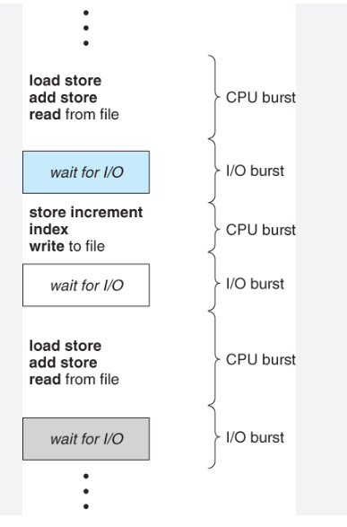
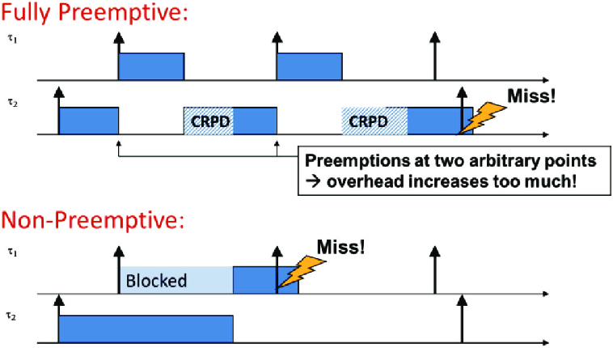
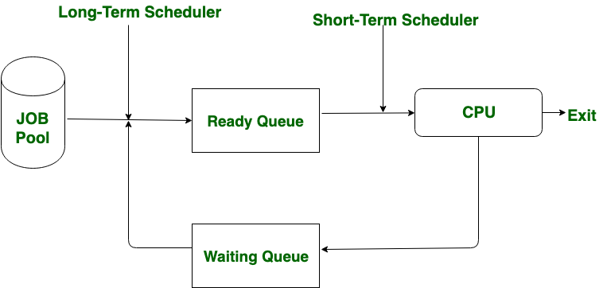
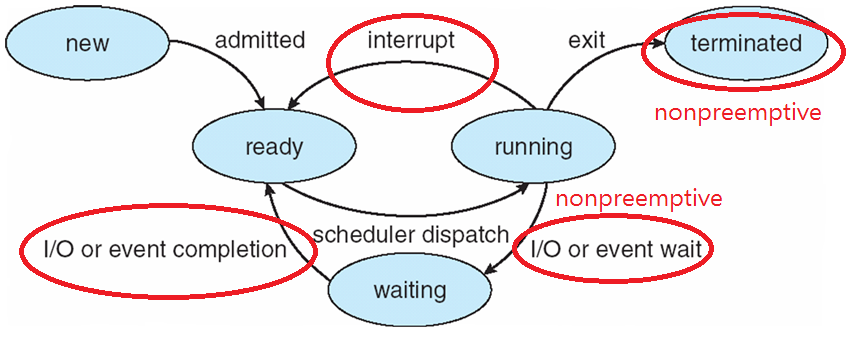

### Burst cycle (CPU , I/O)

### Scheduling points
1. switch for running to waiting 
2. switch for running to ready
3. switch for waiting to  ready
4. Terminates

### preemptive VS non-preemptive

### Scheduler vs Dispatcher
Scheduler just determine the process which will run .
Dispatcher Give the control to the process to run.

what Dispatcher actually do ?
1. switch context
2. switch the mode (user , kernel)
3. jump to the stopped location of the process to restart it 

### Dispatcher latency 
the time taken by the dispatcher to stop one process to run another one .

### Long-time scheduler VS short-time scheduler

|Long-Term Scheduler|Short-Term Scheduler|
|---|---|
|Long-Term Scheduler takes the process from job pool.|Short-Term Scheduler takes the process from ready queue.|
|Long-Term Scheduler is also known as **Job Scheduler**.|Short-Term Scheduler is also known as **CPU Scheduler**.|
|In Long-Term Scheduler, the programs are setup in the queue and as per the requirement the best one job is selected.|In Short-Term Scheduler no such queue is exist.|
|It regulates the more DOM (Degree of Multi-programming).|It regulates the less DOM (Degree of Multi-programming).|
|It regulates the programs which are selected to system for processing.|It ensures which program is suitable or important for processing.|
|Speed is less than the short-term scheduler.|Speed is very fast as compared to long-term scheduler.|
|Long-Term Scheduler changes the process state from **New** to **Ready**.|Short-Term Scheduler changes the process state from **Ready** to **Running**.|
|Time-sharing operating systems have no long-term scheduler.|It may be minimal in time-sharing system.|
|It select a good process, mix of I/O bound and CPU bound.|It select a new process for a CPU quite frequently.|
|Long-Term Scheduler control Multi-Programming|Short-Term Schedule control Multitasking|

## process state :

