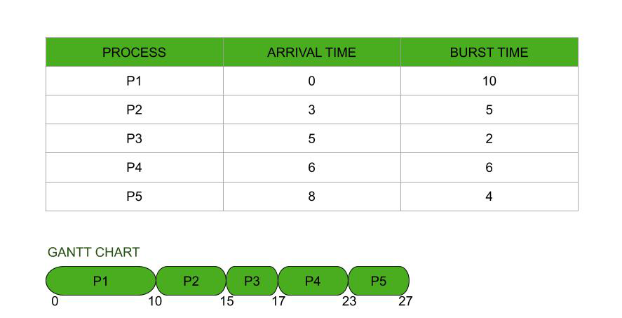

1. First come first serve 
2. shortest job first 
3. priority
4. round robin

## 1. First come first serve Scheduler

## 2.shortest job first Scheduler

### non preemptive  shortest job first 
once CPU given to the process it cannot be preempted until completes its CPU burst.

### preemptive shortest job first 
if a new process arrives with CPU burst length less than remaining time of current executing process, preempt. This scheme is know as the Shortest- Remaining-Time-First (SRTF).

## 3.Priority Scheduler
Priority number (integer) is associated with each process .
The CPU is allocated to the process with the highest priority (smallest integer = highest priority). 
there are two types of priority Scheduler (Preemptive , Non-preemptive)
SJF is a priority scheduling where priority is the predicted next CPU burst time. 
Problem = Starvation - low priority processes may never execute.
Solution = Aging - as time progresses increase the priority of the process. 

## 4.Round robin scheduler 
each process will take a small amount of CPU time .

