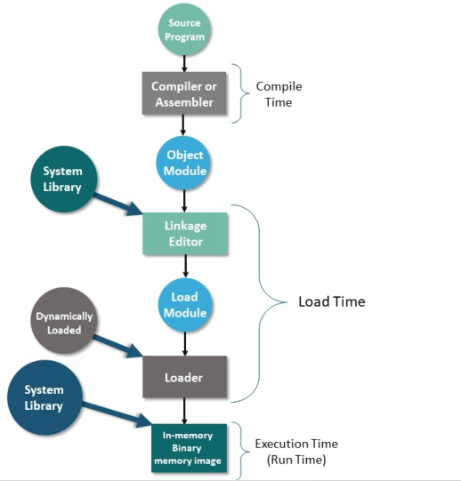
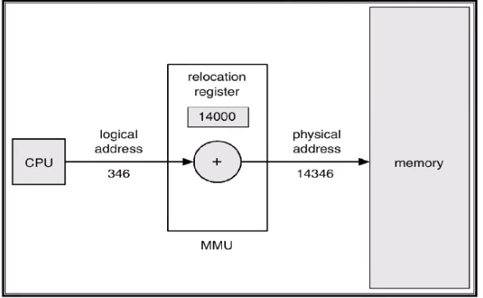

Logical Address Space : generated by the CPU (virtual address)
Physical Address Space :  address seen by the memory unit 

### compile , load and execute time binding 

## compile time binding 
In this address binding method, memory addresses are assigned to a program when it is being compiled. Since the memory addresses are assigned during the compile time, that is, before the program is executed, the addresses are fixed. They cannot be changed when the program is being executed.
To change the address space in the main memory we will change the address space in the code and then recompile the program again.
The logical address is equal to the physical address in compile time binding .
 Used for embedded system applications .

## load time binding 
 In this process, memory addresses are assigned to the program during its load time. So, memory addresses can be changed during the execution of the program.
In the code we determine the address space as an (offset + location).
This location will calculated by the MMU after running the program .
The physical address is equal to the logical address + location.
If we need to change the location of this program we will terminate it and then restart it again.

## execute time binding 
in this type of address binding, addresses are assigned to programs while the program is running. This means that the memory addresses can change while the program is being executed. It is also known as run-time binding.
This translation between the logical address and physical address is done by the **memory management unit (MMU)**

## memory management unit (MMU)
It is a hardware device that maps the logical address (virtual) to the physical address .

In this picture the CPU need logical address of special process (346)
but this address located in another location in the main memory(physical address ).
We use the MMU to translate the logical address to it's physical address .
physical address = logical address + base address of that process (stored in relocation register).
