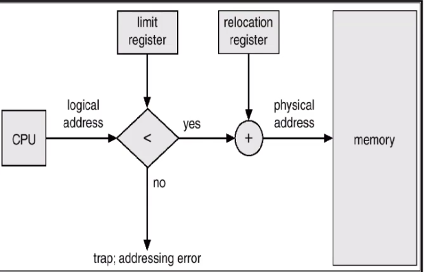
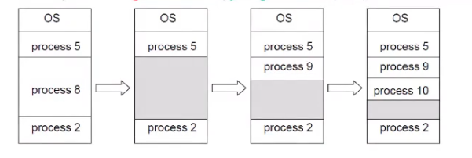
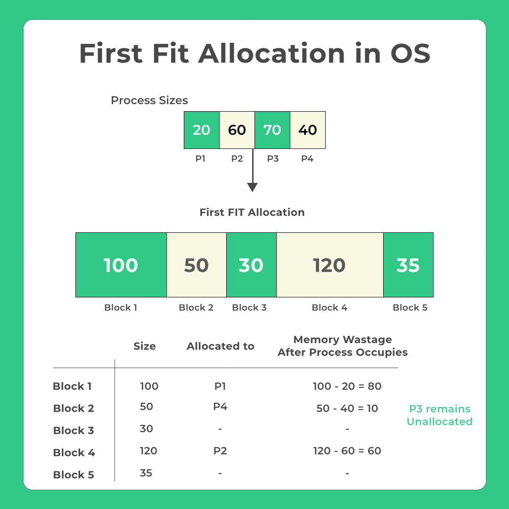
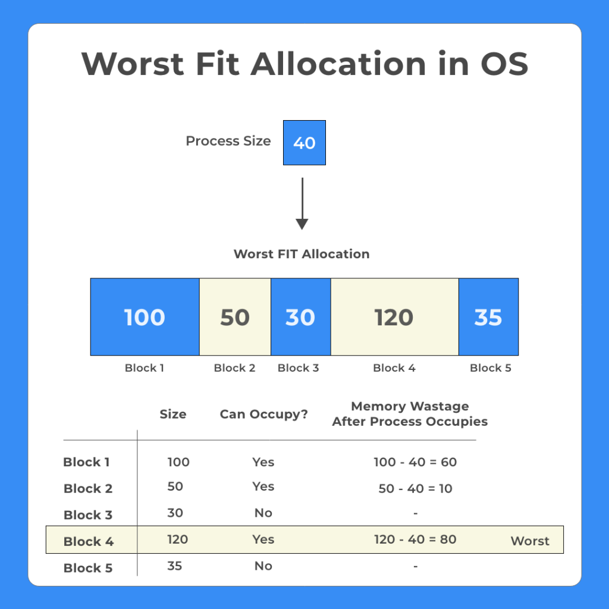
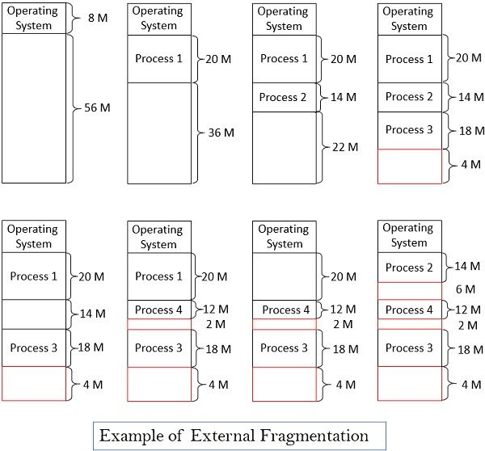
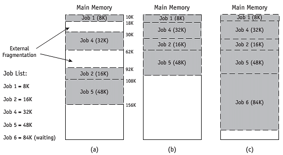

Main memory usually consist of two parts:
1. Operating system (usually in the low memory with interrupt vector)
2. User processes (usually in the high memory)

## 1.Single partition

**Relocation register** used to protect the user processes from each other.
it contain the base address of the process .
**Limit register** contain the size of the process .

In this picture the CPU need to excess logical address .
The MMU check first if this address is less than the size of the process or not 
if it less than the limit register , the MMU will add the base of that process to reach to the physical address in main memory of that process .
If the logical address is grater than the limit address , there is violation (the process need to excess address space of another process ).

## 2.Multi partition
When a process arrives , it is allocate memory from from a hole large enough to accumulated it .

The operating system maintain information about :
1. allocated partitions
2. free partitions (holes)

## Dynamic storage allocation 
### first fit
allocate the process in the first hole that is big enough.

### best fit
allocate the process the smallest hole that is big enough.	 	

### worst fit
allocate the process in the largest hole.

## fragmentation
1. external fragmentation
2. internal fragmentation

### 1.external fragmentation

### 2.internal fragmentation
when we divide the process into fixed size pages the last page may be contain an internal fragmentation.
the maximum fragmentation is size of page - 1 byte .
assume the page size is 4K byte
after we divide it only one byte remaining so there is a (4K - 1 ) internal fragmentation.

### compaction

