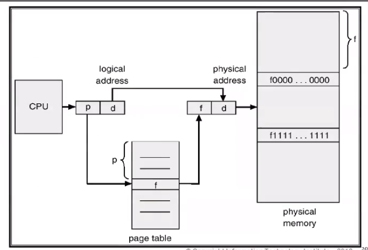
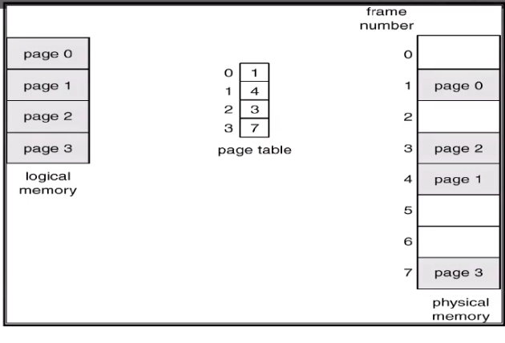
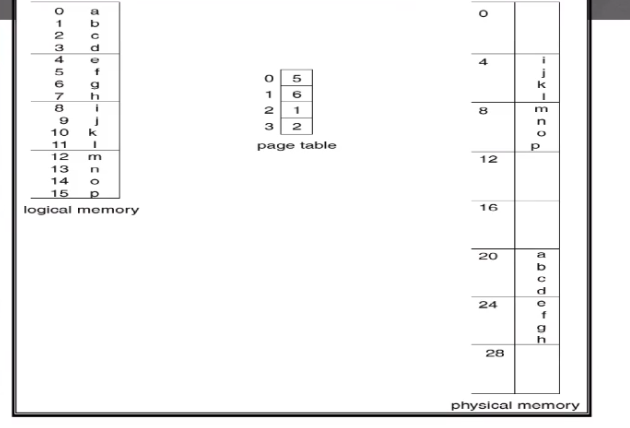
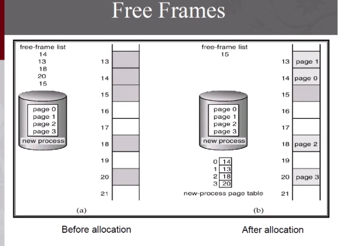
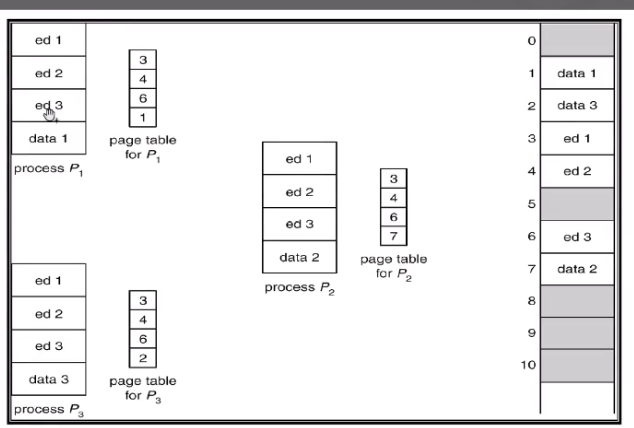

we can allocate the processes in non-Contiguous way (paging , segmentation).

Divide the main memory into fixed size blocks called frames.
Divide every process into the same fixed size (pages).
The problem of paging is  internal fragmentation.

## address translation
The address witch generated by the CPU divide into page number and offset(displacement).

**Page number (p)** used as an index into page table which contain the base address of each page in the physical memory.

**Page Offset (d)** combined with the base address to define the physical memory address that is sent to the memory unit.

Paging example
we have process contain 4 pages (0 to 3) these pages will store in the page table as shown in the figure.
we allocate :- 
page 0 in index 1 in main memory 
page 1 in index 4 in main memory 
page 2 in index 3 in main memory 
page 3 in index 7 in main memory 
so the page table will be as shown 1 , 4 , 3 , 7 .
the index of page table is the number of page .
the element stored in the index is the index of this page in main memory.

if the CPU generate logical address 7(h). 
Page number = Logical address / Page size => PN =  7/4 = 1
offset = Logical address% Page size => d = 7%4 = 3 
Frame = Table(Page number) => F = T(1) = 6 
Physical address = Framer * Page size + offset => Physical address = 6*4+3 = 27. this is the physical address in main memory. 

another example 
the CPU generate logical address 15 (P) .
PN = 15/4 = 3
d = 15%4 = 3
F = T(3) = 2
Physical address = 2 * 4 + 3 = 11

### shared pages 
one copy of code all the process have the same page table contain the pages of the code.
every process has it's own page data.

we have three process (P1,P2,P3)
all the processes shared the same Pages(ed1,ed2,ed3) =>code
every process has it's own data page.

