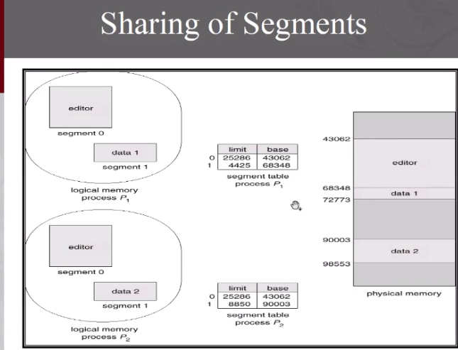

The segment is a logical unit that mean it is not a fixed size 
units :
main program
functions
stack 
symbol table ,..........

### segmentation architecture

logical address  = segment number + offset
there is a segment table maps the logical address to the physical address by known the base and the limit of each segment.

