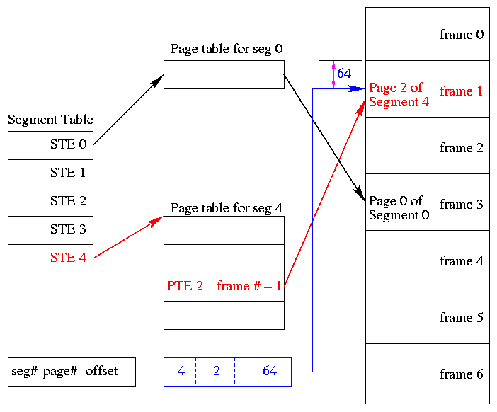

The MULTICS system solved the problem of the external fragmentation and the headache of the searching in page table(the page table is very large).

The Segment table entry contain not the base address of the segment but  rather the base address of a page table for this segment.

Every segment contain number of pages.
The logical address will contain the segment number + the page number + displacement.
